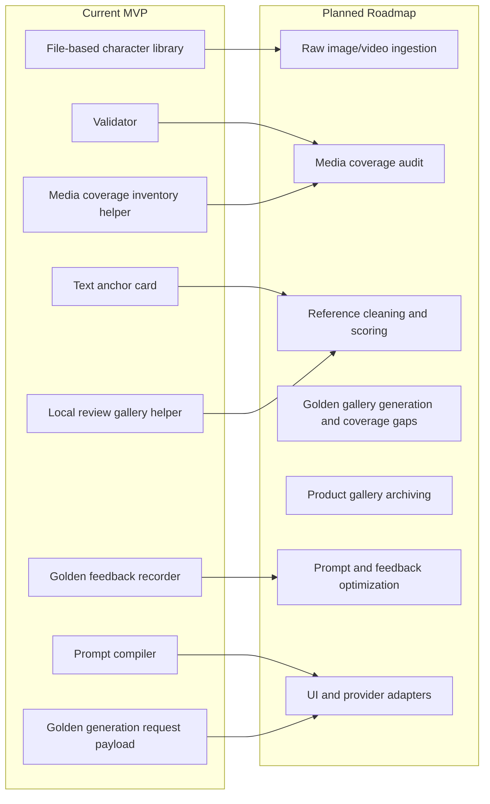

# Character Anchor Skill

[Chinese README](README.zh-CN.md)

Character Anchor Skill is a reusable workflow for turning a large set of character media into a stable golden reference gallery, then using that gallery to generate consistent character images and video keyframes.

This repository is a GitHub-ready workflow MVP and reference implementation. It also includes a top-level [SKILL.md](SKILL.md) so the workflow can be read as a portable skill definition. The current `0.3.0` local version adds media-first helper scripts, but it is still a CLI-driven workflow scaffold rather than a packaged app or built-in image generator.

See [CHANGELOG.md](CHANGELOG.md) for release notes and [CONTRIBUTING.md](CONTRIBUTING.md) for contribution and privacy rules.

## Core Idea

A character anchor is not just a face reference. It is a curated identity system built from raw images, videos, Live Photos, generated candidates, user feedback, approved golden references, and successful product images.

The highest-priority goal is face consistency. Body proportions, presence, motion, wardrobe logic, temperament, and style are secondary anchors that make the character feel like the same person across scenes.

## Why This Exists

AI image and video workflows often fail when the same person or character must appear across many outputs. Raw user media is usually messy: different lighting, angles, expressions, quality levels, outfits, and identity stability.

This skill is designed to answer one practical question:

> Given a large amount of messy raw character material, how do we select, clean, generate, approve, and reuse a set of golden references that make future outputs look like the same person?

## Workflow

```text
raw user media
-> media inventory and coverage audit
-> safety and consent check
-> primary subject identification
-> quality filtering
-> reference quality gate
-> usable reference selection
-> face geometry lock
-> coverage and reference report
-> user chooses deeper screening or generation
-> external golden-candidate generation request
-> generated candidates from an external identity-preserving workflow
-> face similarity and user likeness review
-> user review and approval
-> golden reference gallery
-> scene image or video keyframe generation
-> successful product image archive
-> prompt and feedback optimization
```

For real use, start with media instead of a long manual questionnaire:

1. Choose upload mode: messy bulk media, or curated 10-30 clear references.
2. Run a coverage audit so the system reports what it counted and what it has not visually reviewed.
3. Use AI/human review to remove hard-defect source references.
4. Lock face geometry from the selected references so later golden candidates preserve face length, eye spacing, brow distance, mouth width, jaw shape, and other stable proportions.
5. Build a local review gallery when chat previews are unreliable.
6. Create a golden-candidate generation request for an external identity-preserving image workflow.
7. Record user likeness feedback before anything is promoted into `references/golden/`.

## Current vs Planned



## MVP Features

- Initialize a reusable character anchor library.
- Audit a raw media folder with `scripts/audit_media_coverage.py` so users can see how many images/videos were inventoried and what has not been visually reviewed.
- Build a local HTML review gallery with `scripts/build_review_gallery.py`.
- Record a face geometry lock with `scripts/update_face_lock.py` before preparing external golden-candidate generation.
- Create an external golden-candidate generation request with `scripts/generate_golden.py`.
- Record user likeness feedback with `scripts/record_golden_feedback.py`.
- Make review coverage user-visible: report how many images, videos, and frames were actually inspected before golden references are selected.
- Reserve an AI/human source-reference screening workflow for hard defects, then let the user choose whether to run deeper screening or prepare an external golden-candidate generation request.
- Store raw references, rejected references, and approved golden references.
- Separate the target character from other people who appear in the same media.
- Reject or quarantine low-quality references before they can affect golden candidate generation.
- Store identity, face, body, presence, motion, wardrobe, style, and negative rules separately.
- Compile a raw scene request into a character-consistent prompt.
- Keep externally generated golden candidates out of `references/golden/` until they pass face similarity and user likeness review.
- Track golden gallery coverage gaps such as back view, 90-degree side view, long shot, full body, and motion references.
- Reserve a product gallery structure for successful images and prompt metadata.
- Validate the library structure and JSON/JSONL files.
- Provide a fictional demo character that can be used publicly.

## Project Structure

The public package intentionally includes only the fictional `characters/mira-vale` demo. Local test character libraries under `characters/` are ignored by default so private experiments, user media, and generated assets do not get published accidentally.

If you create your own character with `init_character_anchor.py`, it will also be ignored by Git by default. This is a privacy feature. Keep real-person or authorized-media libraries local or in a private repository unless you intentionally change `.gitignore`.

```text
characters/<character-id>/
  anchor-card.md
  profile.json
  consent.json
  references/
    raw/
    golden/
    rejected/
    index.json
  anchor-library/
    identity.md
    face.md
    body.md
    presence.md
    motion.md
    wardrobe-logic.md
    voice-and-dialogue.md
    style.md
    temperament.md
    invariants.md
    allowed-variations.md
    negative-rules.md
  prompt-library/
  outputs/
    approved/
    product-gallery/
    candidates/
    failed/
    blocked/
  feedback/
  adapters/
  quality/
    coverage/
    face-lock/
  training-package/
```

## Golden Gallery

The golden gallery is the most important output of the skill. It is a small approved set of reference images that users can trust when generating new images or video keyframes.

Generated candidate images are not golden references by default. If a candidate looks beautiful but does not look like the target person or character, it must stay in `outputs/candidates/` or `outputs/failed/`, with failure notes that can improve the next prompt.

A strong golden gallery should include:

- frontal face reference
- 3/4 angle face reference
- 90-degree side or profile reference
- back-view reference for hair, shoulders, posture, and wardrobe continuity
- multiple expression references
- upper-body reference
- full-body proportion reference
- long-shot silhouette reference for video keyframes and distant scenes
- motion or action reference
- outfit or wardrobe logic references
- style baseline references

A strong workflow should report missing coverage before generation. For example, a gallery may be strong enough for portraits but weak for video keyframes if it lacks back view, 90-degree profile, long-shot, or motion references.

A strong workflow should also keep rejected examples in `references/rejected/` or failure logs, so users can see what went wrong without mixing failed material into the golden gallery.

## Product Gallery

The product gallery stores successful images and keyframes that users actually like. It is different from the golden gallery:

- `references/golden/` stores reference images used to guide future generation.
- `outputs/product-gallery/` stores successful final products created for user needs.

Each product image should keep its source prompt, compiled prompt, selected golden references, model/provider metadata, user rating, and success notes. Successful product images can later be promoted into golden references when they are identity-stable and useful for future generation.

## Optimization

Later versions should optimize both prompts and user preference.

Prompt optimization records which prompts, references, model settings, and negative rules produce stable and satisfying results.

Feedback optimization turns user choices into reusable correction rules, such as "eyes too large", "body changed", "too young", "too glamorous", or "this one should become a golden reference".

## Safety And Authorization

Character Anchor Skill is designed for fictional characters, user-owned media, or media the user is authorized to use. The MVP does not perform automatic biometric verification, but it includes explicit safety gates:

- Do not process private or real-person media unless the user confirms they own it or are authorized to use it.
- Do not use unauthorized images, videos, Live Photos, screenshots, or generated likenesses.
- Do not create NSFW, explicit, erotic, fetish, or overexposed outputs.
- Treat age-uncertain subjects as minor-safe by default.
- Do not use minor or age-uncertain media for adult, romantic, revealing, or glamorized generation.
- Route unsafe outputs to `outputs/blocked/` as metadata only.

See [safety checklist](docs/safety-checklist.md) and [safety policy](docs/safety-policy.md).

## Quick Start

### Try the demo

Validate the demo character:

```bash
python scripts/validate_character_anchor.py characters/mira-vale
```

Newly initialized characters may show a consent warning until `consent.json` is filled in. Confirm the media is fictional, user-owned, or authorized before promoting any references to `references/golden/` or using the character for public outputs.

Compile a scene request:

```bash
python scripts/compile_prompt.py characters/mira-vale --request "Mira walks through a rain-soaked train station at night, holding her notebook." --provider provider-neutral
```

Add `--write` if you want to append the prompt to the character's JSONL logs.

The text-only Mira Vale demo does not include image references or golden image IDs. For a character that already has approved golden references, you can pass them by indexed id or path:

```bash
python scripts/compile_prompt.py characters/<character-id> --request "Character in a quiet archive room." --provider provider-neutral --reference-image <golden-reference-id-or-path>
```

This only works after the referenced id exists in `references/index.json` with role `golden`, or the referenced file exists under `references/golden/`. In a full image/video workflow, the compiled prompt should be used together with those approved golden references.

The compiler intentionally excludes the `## Requires User Confirmation` section from `allowed-variations.md`. That section is used as a human review boundary, not as an automatically allowed variation.

If you have `make` installed, you can run the read-only demo flow with:

```bash
make demo
```

### Try the media-first helpers

Inventory a media folder without claiming visual review:

```bash
python scripts/audit_media_coverage.py <path-to-raw-media>
```

Build a local HTML gallery for image review:

```bash
python scripts/build_review_gallery.py <path-to-images> --output outputs/tmp/review-gallery.html
```

Create or tune a face geometry lock:

```bash
python scripts/update_face_lock.py characters/<character-id> --measurement eye_spacing_ratio=1.0 --measurement face_length_to_width=1.42 --qualitative-lock "moderate eye spacing" --status estimated
```

Create a golden-candidate generation request payload for an external workflow:

```bash
python scripts/generate_golden.py characters/mira-vale --request "Create a front, side, back, full-body, and long-shot golden candidate batch." --provider provider-neutral
```

If you pass `--reference-image`, the value must be an approved golden reference id/path or a real file under `references/golden/`. Private experiments can opt out with `--allow-unvalidated-reference`, but those payloads should not be used for public release or golden promotion.

Record user feedback on a generated candidate:

```bash
python scripts/record_golden_feedback.py characters/mira-vale --candidate-id candidate_0001 --user-rating 4 --liked-point "closer face shape" --disliked-point "jaw still too sharp" --dry-run
```

The helper scripts intentionally separate inventory, review, generation requests, and feedback. `generate_golden.py` does not generate pixels by itself; it prepares a structured payload for ComfyUI, InstantID, PuLID, IP-Adapter, or another external identity-preserving workflow.

### Create your own character anchor

```bash
python scripts/init_character_anchor.py --root . --character-id example-character --display-name "Example Character"
```

After initialization, fill in `anchor-card.md` and the files under `anchor-library/` before compiling prompts. Empty templates can validate structurally, but stable results depend on specific face, body, presence, style, variation, and negative-rule anchors.

## Demo Character

The repository includes `characters/mira-vale`, a fictional adult demo character. It is not an empty template: it includes a filled anchor card, face/body/presence/motion/wardrobe anchors, negative rules, a review rubric, and sample prompt logs. The MVP intentionally does not include real images or golden references, so it can be published safely while demonstrating how text anchors compile into prompts. See the [Mira Vale demo walkthrough](examples/mira-vale.md).

Her anchor covers:

- face consistency
- body and proportion consistency
- quiet, observant presence
- compact movement habits
- practical wardrobe logic
- negative rules for common AI drift

## Portfolio Framing

This project is designed as an AI portfolio piece for character consistency in AI image and video production. It demonstrates raw asset workflow design, reference curation, prompt engineering, structured data, safety-aware media handling, and reusable tooling.

## Status

Version `0.3.0` is a media-first workflow scaffold: it keeps the file-based MVP, then adds coverage inventory, HTML review galleries, external golden-generation request payloads, and feedback recording. It still does not include automatic face embeddings, biometric similarity scoring, video frame extraction, or a built-in image generator.
