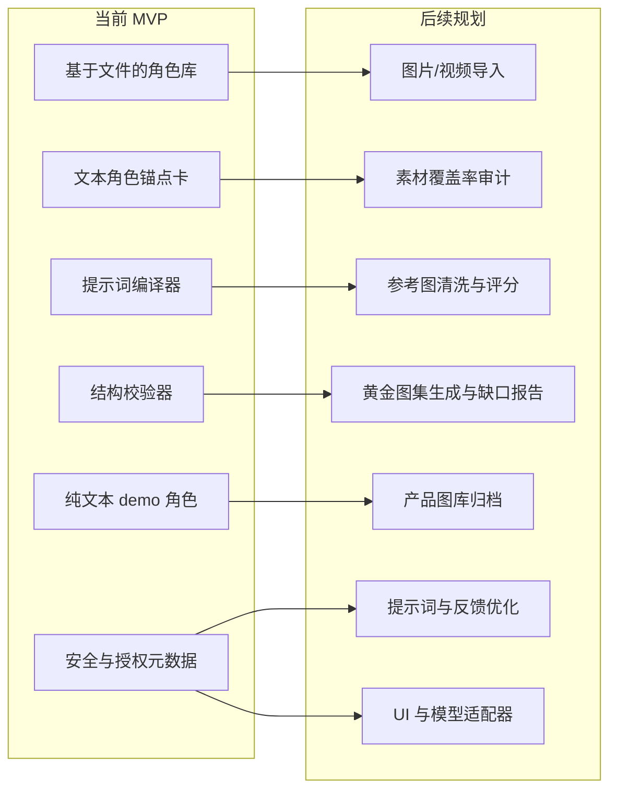

# Character Anchor Skill

[English README](README.md)

Character Anchor Skill 是一个可复用的角色一致性工作流：它把大量人物素材清洗、筛选并沉淀成稳定的黄金参考图集，再用这些黄金参考图生成一致的人物图片和 AI 视频关键帧。

## 核心理念

角色锚点不是单张脸部参考图，而是一套经过整理的身份系统。它由原始图片、视频、Live Photo、候选生成图、用户反馈、黄金参考图和成功产品图共同构成。

最高优先级是脸部一致性。身材比例、气质、动作习惯、服装逻辑、性格气场和视觉风格是第二层锚点，用来让角色在不同场景里仍然像同一个人。

## 为什么需要它

AI 图片和视频工作流在多次生成同一人物时很容易漂移。用户上传的原始素材通常很混乱：光线不同、角度不同、表情不同、清晰度不同、服装不同，人物身份稳定性也不同。

这个 Skill 要解决的问题是：

> 给定大量混乱的人物原始素材，如何筛选、清洗、生成、审核并复用一组黄金参考图，让后续图片和视频关键帧仍然像同一个人？

## 工作流

```text
用户原始素材
-> 素材清单与覆盖率审计
-> 安全与授权检查
-> 关键人物识别
-> 质量筛选
-> 参考图质量门控
-> 可用参考图选择
-> 覆盖率与参考图报告
-> 用户选择继续深筛或直接生成
-> AI 生成黄金参考图候选
-> 脸部相似度与用户像不像审核
-> 用户审核与确认
-> 黄金参考图集
-> 场景图或视频关键帧生成
-> 成功产品图归档
-> 提示词与用户反馈优化
```

## 现状 vs 规划



## 初版功能

- 初始化可复用的人物角色锚点库。
- 记录素材覆盖率审计工作流，避免后续实现大批量图片/视频导入时被悄悄缩减成少量抽样。
- 让审查覆盖范围对用户可见：在选择黄金参考图前，明确报告实际看过多少图片、视频和视频帧。
- 由 AI 对原始参考图做硬伤筛选，再让用户选择继续深度筛选，或直接用当前合格参考图生成黄金候选图。
- 存储原始参考图、拒绝参考图和已审核黄金参考图。
- 区分目标人物和同一素材中出现的其他人物。
- 在生成黄金候选图前，先拒绝或隔离低质量参考图。
- 分开记录身份、脸部、身材、气质、动作、服装、风格和负面规则。
- 把普通场景需求编译成角色一致性提示词。
- AI 生成的黄金候选图必须通过脸部相似度和用户“像不像”审核后，才能进入 `references/golden/`。
- 记录黄金图集覆盖缺口，例如背面、90 度侧身、远景、全身和动作参考。
- 预留产品图库结构，用于存放成功产品图及其提示词元数据。
- 校验目录结构和 JSON/JSONL 文件。
- 提供一个可公开展示的虚构 demo 角色。

## 项目结构

公开包只保留虚构的 `characters/mira-vale` demo。`characters/` 下本地测试角色库默认会被忽略，避免个人测试素材、用户素材或生成资产被误发布。

```text
characters/<character-id>/
  anchor-card.md
  profile.json
  consent.json
  references/
    raw/
    golden/
    rejected/
    index.json
  anchor-library/
    identity.md
    face.md
    body.md
    presence.md
    motion.md
    wardrobe-logic.md
    voice-and-dialogue.md
    style.md
    temperament.md
    invariants.md
    allowed-variations.md
    negative-rules.md
  prompt-library/
  outputs/
    approved/
    product-gallery/
    candidates/
    failed/
    blocked/
  feedback/
  adapters/
  quality/
  training-package/
```

## 黄金参考图集

黄金参考图集是这个 Skill 最重要的产物。它是一组经过审核的小型高质量参考图，用户之后生成图片或视频关键帧时可以反复调用。

AI 生成的候选图默认不是黄金参考图。如果一张图很好看但不像目标人物或角色，它只能留在 `outputs/candidates/` 或 `outputs/failed/`，并记录失败原因，用来改进下一轮 prompt。

一个好的黄金图集应该包括：

- 正脸参考
- 3/4 侧脸参考
- 90 度侧脸参考
- 背面参考，用来固定发型、肩背、体态和服装背面逻辑
- 多种表情参考
- 半身参考
- 全身身材与比例参考
- 远景轮廓参考，用于视频关键帧和远景镜头
- 动作或运动气质参考
- 服装逻辑参考
- 风格基准参考

一个好的工作流应该在生成前报告缺失维度。例如：当前图集可能足够生成头像，但如果缺少背面、90 度侧脸、远景或动作参考，就不适合直接支撑视频关键帧。

一个好的工作流也应该在 `references/rejected/` 或失败日志中保留拒绝样例，用来说明哪里出了问题，但不要把失败素材混进黄金图集。

## 产品图库

产品图库用于存储用户真正满意的成功图片和视频关键帧。它和黄金图集不同：

- `references/golden/` 存放用于指导未来生成的黄金参考图。
- `outputs/product-gallery/` 存放用户需求下生成出来的成功产品图。

每张产品图都应该保留原始需求、编译后提示词、调用过的黄金参考图、模型/参数信息、用户评分和成功原因。特别稳定且有复用价值的产品图，后续可以升级为新的黄金参考图。

## 优化闭环

后期版本需要加入提示词优化和用户反馈优化。

提示词优化用于记录哪些 prompt、参考图、模型参数和负面规则更容易生成稳定且让用户满意的结果。

用户反馈优化会把用户选择转化成可复用的修正规则，比如“眼睛太大”“身材变了”“显得太年轻”“太网红”“这张可以进入黄金图集”。

## 安全与授权

Character Anchor Skill 只面向虚构角色、用户自有素材，或用户已获得授权的素材。初版不做自动生物识别审核，但包含明确的安全门禁：

- 未确认用户拥有或授权前，不处理私人或真人素材。
- 不使用未授权图片、视频、Live Photo、截图或生成肖像。
- 不生成 NSFW、色情、擦边、恋物或过度暴露内容。
- 年龄不明时默认按未成年人安全模式处理。
- 不把未成年人或年龄不明素材用于成人化、恋爱化、暴露或魅惑化生成。
- 不安全输出只以 metadata 形式进入 `outputs/blocked/`。

更多说明见 [safety checklist](docs/safety-checklist.md) 和 [safety policy](docs/safety-policy.md)。

## 快速开始

### 试运行 demo

校验示例角色：

```bash
python scripts/validate_character_anchor.py characters/mira-vale
```

新初始化的角色在填写 `consent.json` 前可能会出现 consent warning。请先确认素材是虚构角色、用户自有素材，或已经获得授权，再把参考图升级到 `references/golden/`，或用于公开输出。

编译一个场景生成需求：

```bash
python scripts/compile_prompt.py characters/mira-vale --request "Mira walks through a rain-soaked train station at night, holding her notebook." --provider provider-neutral
```

如果想把本次 prompt 写入角色的 JSONL 日志，可以额外加上 `--write`。

纯文本 Mira Vale demo 不包含图片参考。对于已经拥有审核通过黄金参考图的角色，可以用索引 ID 或路径传入：

```bash
python scripts/compile_prompt.py characters/<character-id> --request "Character in a quiet archive room." --provider provider-neutral --reference-image <golden-reference-id-or-path>
```

这只有在该 ID 已经存在于 `references/index.json` 且 role 为 `golden`，或该文件真实存在于 `references/golden/` 下时才会成功。在完整图片/视频工作流中，编译后的提示词应该和这些已审核黄金参考图一起使用。

编译器会故意跳过 `allowed-variations.md` 里的 `## Requires User Confirmation` 章节。这个章节是给人工审核看的边界，不会被当成自动允许的变化写进 prompt。

如果你安装了 `make`，可以用一条命令跑只读 demo 流程：

```bash
make demo
```

### 创建自己的角色锚点库

```bash
python scripts/init_character_anchor.py --root . --character-id example-character --display-name "Example Character"
```

初始化后，请先填写 `anchor-card.md` 和 `anchor-library/` 下的各类锚点文件，再编译 prompt。空模板可以通过结构校验，但稳定效果依赖具体的脸部、身材、气质、风格、允许变化和负面规则。

## 示例角色

仓库内包含一个虚构成年示例角色 `characters/mira-vale`。它不是空模板：已经填写了 anchor card、脸部/身材/气质/动作/服装逻辑、负面规则、review rubric 和示例 prompt 日志。初版故意不包含真实图片或黄金参考图，方便安全公开，同时展示纯文本角色锚点如何被编译成 prompt。更多说明见 [Mira Vale demo walkthrough](examples/mira-vale.md)。

她的角色锚点包括：

- 脸部一致性
- 身材与比例一致性
- 安静、观察型气质
- 克制的动作习惯
- 实用型服装逻辑
- 常见 AI 漂移负面规则

## 作品集定位

这个项目可以作为 AI 图片和 AI 视频角色一致性方向的作品集项目。它展示了原始素材工作流设计、参考图筛选、提示词工程、结构化数据、安全意识和可复用工具设计能力。

## 当前状态

`0.1.0` 是两天内可上线的初版：基于文件、CLI 驱动、模型无关。后续版本可以加入图片/视频导入、脸部相似度评分、黄金图集生成与覆盖缺口补全、产品图库浏览、视觉审核、模型适配器、UI 和训练数据导出。
